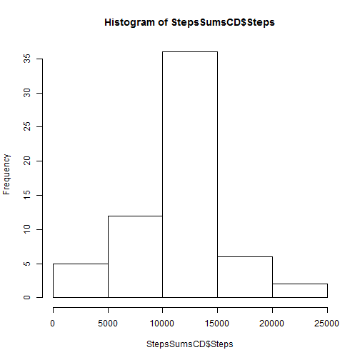

```r
library("knitr")
opts_chunk$set(echo=TRUE)
opts_chunk$set("base64_images", "No")
```

## Loading and preprocessing the data

```r
RawData <- read.csv("activity.csv")
RawData$date <- as.Date(RawData$date)
StepsSums <- aggregate(
  RawData$steps ~ RawData$date,
  FUN = sum,
  na.rm=T)
names(StepsSums) <- c('Date','Steps')
```

## What is mean total number of steps taken per day?
### 1. Plotting the Number of Steps Each Day

```r
hist(StepsSums$Steps,main = "Histogram of The Total Number of Steps",xlab = "Steps")
```

 
### 2. Computing the Mean and Median

```r
stepsMean <- mean(StepsSums$Steps)
stepsMedian <- median(StepsSums$Steps)
```

#### Mean is *10766.19*  
#### Median is *10765*

## What is the average daily activity pattern?
### 1. Time Series Plot

```r
stepsAvgPerInterval <- aggregate(
  RawData$steps ~ RawData$interval,
  FUN = mean,
  na.rm=T)
names(stepsAvgPerInterval) <- c('Intervals','Averages')

plot(x = stepsAvgPerInterval$Intervals,
     y = stepsAvgPerInterval$Averages, 
     type="l", 
     xlab = "5-Minute Interval", 
     ylab = "Average Steps Cross All Days")
```

 

```r
IntervalWithMaxNumberOfSteps <- stepsAvgPerInterval[
  stepsAvgPerInterval$Averages == max(stepsAvgPerInterval$Averages),1]
```
### 2. The 5-Minute interval with the maximum number of steps across all days is: *835*

## Imputing missing values

```r
#Calculating the missing values
valuesWithNACount <- nrow(RawData[is.na(RawData$steps) == T,])
```
### 1. The total number of missing values is: *2304*

### 2. Cleaning The Data 

```r
#Cleaning The Data using the Computed average before in stepsAvgPerInterval and storing it in CleanData
CleanData <- RawData
CleanData$steps <- cbind(apply(CleanData,1,
                               function(x) { 
                                 if(is.na(x[[1]])) 
                                   stepsAvgPerInterval[stepsAvgPerInterval$Intervals == as.numeric(x[[3]]),2]
                                 else 
                                   as.numeric(x[[1]]) })
                         )
```
### 3. Plotting the Number of Steps Each Day (Cleaned Data)

```r
StepsSumsCD <- aggregate(
  CleanData$steps ~ CleanData$date,
  FUN = sum,
  na.rm=T)
names(StepsSumsCD) <- c('Date','Steps')

cleanStepsMean <- mean(StepsSumsCD$Steps)
cleanStepsMedian <- median(StepsSumsCD$Steps)

hist(StepsSumsCD$Steps)
```

 
#### Clean Data Mean is *10766.19*  
#### Clean Data Median is *10766.19*

## Are there differences in activity patterns between weekdays and weekends?
### There is a small diffrence in Median only

## Plotting the Panel Plot

```r
stepsAvgPerIntervalCD <- aggregate(
  CleanData$steps ~ CleanData$interval,
  FUN = mean,
  na.rm=T)
names(stepsAvgPerIntervalCD) <- c('Intervals','Averages')

CleanData$Weekday <- factor(weekdays(as.POSIXct(CleanData$date)))
CleanData$day_type <- factor(cbind(apply(CleanData,1,
                                         function(x) { 
                                           wd <- weekdays(as.POSIXct(x[[2]])); 
                                           if(wd == 'Saturday' || wd == 'Sunday') 'weekend' else 'weekday' 
                                           }
                                         )
                                   )
                             )
library("lattice")
avgWeekSteps <- aggregate(steps ~ interval + day_type , data = CleanData, mean) 
colnames(avgWeekSteps) <- c("Interval","DayType","AverageSteps")
timeseries <- xyplot(AverageSteps ~ Interval | DayType, 
                     data = avgWeekSteps, type = "l",
                     layout = c(1,2),xlab="Intervals",
                     ylab="Average Number of Steps",
                     main = "Average Number of Steps for Weekends and Weekdays")
print(timeseries)
```

 
